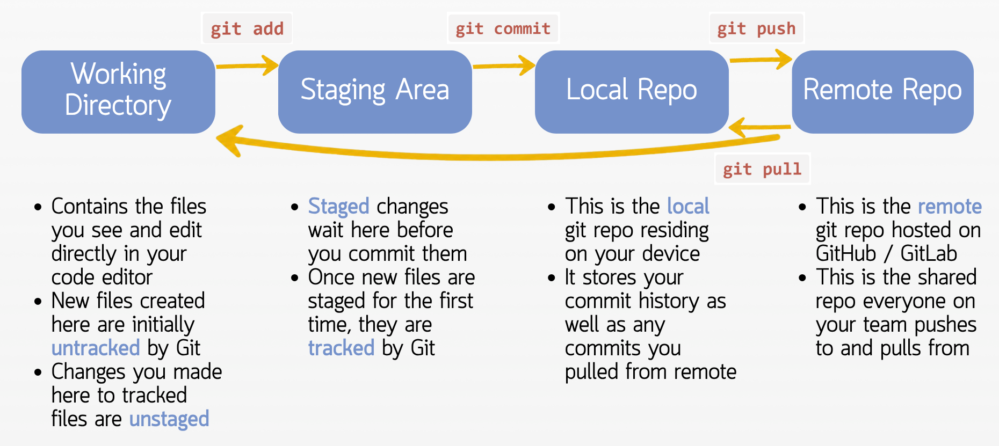

# Session 1: Local Workflows

### Reference Table
<!-- Reference Table -->
<table>
  <colgroup>
    <col style="width: 40%">
    <col style="width: 60%">
  </colgroup>
  <thead>
    <tr>
      <th>Command</th>
      <th>Description</th>
    </tr>
  </thead>
  <tbody>
    <tr>
      <td><code>git clone &lt;HTTPS_address&gt;</code></td>
      <td>Copy a remote repo from GitLab onto your machine as a new folder in your present working directory</td>
    </tr>
    <tr>
      <td><code>git remote -v</code></td>
      <td>Check which remote repo your local repo is linked to</td>
    </tr>
    <tr>
      <td><code>git status</code></td>
      <td>See what has changed, what is staged, and what is untracked. Also tells you if the current folder is a git repo</td>
    </tr>
    <tr>
      <td><code>git status --ignored</code></td>
      <td>Also list files that are being ignored by <code>.gitignore</code></td>
    </tr>
    <tr>
      <td><code>git status -u</code></td>
      <td>List every untracked file individually, instead of collapsing untracked folders into one line (short for <code>--untracked-files=all</code>)</td>
    </tr>
    <tr>
      <td><code>git add &lt;file&gt;</code><br><code>git add file1 file2 file_n</code><br><code>git add .</code></td>
      <td>Stage a specific file<br>Stage a variable number of files at once<br>Stage everything in the present working directory</td>
    </tr>
    <tr>
      <td><code>git commit -m "commit message"</code></td>
      <td>Commit staged changes with a single-line message</td>
    </tr>
    <tr>
      <td><code>git commit</code></td>
      <td>Opens a nano window for you to write multi-line commit messages</td>
    </tr>
    <tr>
      <td><code>git commit --amend -m "corrected message"</code></td>
      <td>Rewrite the message of the last commit (only if not yet pushed)</td>
    </tr>
    <tr>
      <td><code>git commit --amend --no-edit</code></td>
      <td>Add your currently staged changes into the last commit, keeping its message (only if not yet pushed)</td>
    </tr>
    <tr>
      <td><code>git log</code><br><code>git log --oneline</code><br><code>git log -n &lt;number&gt;</code></td>
      <td>View commit history<br>View commit history (condense each into one line)<br>Only show the latest <code>&lt;number&gt;</code> commits</td>
    </tr>
    <tr>
      <td><code>git rm --cached &lt;file&gt;</code><br><code>git rm -r --cached &lt;folder&gt;</code></td>
      <td>Stop tracking a file that was already committed, without deleting it from your machine<br>Same, for a whole folder</td>
    </tr>
    <tr>
      <td><code>git check-ignore -v &lt;file&gt;</code></td>
      <td>Show which line of which <code>.gitignore</code> is causing a file to be ignored</td>
    </tr>
  </tbody>
</table>

> **Tip:** `git log` and `git diff` open their output in a scrollable viewer when it does not fit on your screen. Use `↑` / `↓` to scroll and press **`q`** to quit and get back to your terminal.


<br>


## Activity 1: Initialise a git repo on Gitlab and clone it locally
>**Terms**
>- Remote repo: The version of your repository hosted on GitLab / Github. This is the central copy that your whole team pushes to and pulls from.
>- Local repo: The version of your repository on your own machine. This is where you make changes before pushing them up to the remote.

#### a. Go to GitLab and create a new GitLab repository
- You can name it whatever you want e.g. `Local Git Practice`
- GitLab will give it a machine-readable slug e.g. `Local-Git-Practice`
- You can just create it under your own GitLab account. No need to put it in the SPDM group.
- Tick `Add README`

#### b. Clone the remote repo locally
- In the repo page, copy the HTTPS address again
- In your terminal, ensure you are in the home directory. If not, navigate there using `cd ~`
- Run `git clone <HTTPS_address>` from the home directory

#### c. You now have a local copy of the remote repo you created on GitLab
- The repo will be initalised locally as a folder in your home directory e.g. named `Local-Git-Practice`
- Navigate into this folder
- Running `ls -a` should show the `.git` hidden folder
- You can also run `git status` to verify the current folder is a git repo

#### d. Check your remote is configured correctly
```
git remote -v
```
- The two lines of output should match the URL of the repo on GitLab
- `origin` is the alias Git gave the remote repo when you cloned it, so you don't have to type out the whole URL in future

#### f. Look at your commit history
```
git log
git log --oneline
git log -n 2
```

- `git log` shows the full details of each commit: hash, author, date and message
- `git log --oneline` condenses each commit into one line: a short hash and the message
- `git log -n 2` only shows the 2 most recent commits. You can combine flags, e.g. `git log --oneline -n 2`

<hr>

- Press `q` to exit this screen in the terminal


<br>


## Activity 2: Staging, Commiting and Pushing Changes
>**Background info:**
>
>- **Untracked** files are files that have never been staged to Git (`git add`), such as a new file or new pipeline outputs.
>    - Git doesn't track their changes, and `git restore` ignores them.
>    - Once you stage a new file, they become **tracked** by Git
>- **Unstaged** changes are edits to tracked files that you have not staged yet. They exist only in your working directory.
>- **Uncommitted** changes are staged changes you have not committed yet. They're held in the *staging area* until you commit them
>- **Committed changes** are saved permanently in the repo's history as a snapshot.
>- **Pushed changes** are commits uploaded to a remote repo such as one hosted on GitHub, where other people can pull them.



#### a. Edit the README
- Delete all the default text in `README.md`
- You may add whatever text you want to it, e.g. `This is a README`
- Observe that in the left sidebar, your file explorer highlights `README.md` in yellow (indicating it is a tracked file that has been modified)

<hr>

- Run `git status`
  - You should see:
    ```
    On branch main
    Your branch is up to date with 'origin/main'.

    Changes not staged for commit:
      (use "git add <file>..." to update what will be committed)
      (use "git restore <file>..." to discard changes in working directory)
    	modified:   README.md

    no changes added to commit (use "git add" and/or "git commit -a")
    ```
  - This is an <u>unstaged change</u> <span style="color:skyblue">(the change is only in your working directory)</span>


<hr>

- Run `git add README.md` to stage your change
- Then, run `git status`
  - You should see:
    ```
    On branch main
    Your branch is up to date with 'origin/main'.

    Changes to be committed:
      (use "git restore --staged <file>..." to unstage)
    	modified:   README.md
    ```
  - This is now an <u>uncommitted change</u> <span style="color:skyblue">(the change is now in the staging area)</span>

<hr>

- Run `git commit -m "docs: update README"` to commit your staged change
- Then, run `git status`
  - You should see:
    ```
    On branch main
    Your branch is ahead of 'origin/main' by 1 commit.
      (use "git push" to publish your local commits)

    nothing to commit, working tree clean
    ```
  - This is now a <u>committed change</u> <span style="color:skyblue">(the change is now saved to your local git repo)</span>
  - `working tree clean` means your files match the latest commit exactly, so there is nothing left to stage or commit
- Run `git log --oneline` to see your commit at the top of the history
- Go on GitLab and find your repo.
  - Look at the code.
  - You will not find see the changes you made above, as GitHub hosts the remote Git repo, while your changes are still only on the local Git repo

<hr>

- Run `git push` to push all committed changes to remote
- Then, run `git status`
  - You should see:
    ```
    fefe
    ```
  - The change has now been <u>pushed</u> <span style="color:skyblue">(to the remote git repo hosted on GitLab)</span>
- Now look at your GitLab repo (refresh the page)
  - The updated code should now be visible on GitLab


<br>


## Activity 3: Staging and Committing Multiple Files at a Time
#### a. 


<br>


## Activity 4: Other useful commands and arguments for local workflows
#### a. Unstaging files

#### b. Rewriting commit messages


<br>


## Activity 5: Writing Multi-line Commits


>- Note: We will go through conventions for writing commit messages in Session 6: Team Workflow Standards


<br>


## Activity 6: Using the VSCode IDE for a more user-friendly UI
### Staging and Unstaging Changes


### Committing Changes


<br>


## Activity 6: Interaction with Jupyter Notebooks


<br>


## Activity 7: Writing .gitignore


#### What if the file you want to gitignore has already been pushed?