# Session 1: Local and Individual Workflows

### Reference Table
<!-- Reference Table -->
<table>
  <colgroup>
    <col style="width: 40%">
    <col style="width: 60%">
  </colgroup>
  <thead>
    <tr>
      <th>Command</th>
      <th>Description</th>
    </tr>
  </thead>
  <tbody>
    <tr>
      <td><code>git clone &lt;HTTPS_address&gt;</code></td>
      <td>Copy a remote repo from GitLab onto your machine as a new folder in your present working directory</td>
    </tr>
    <tr>
      <td><code>git remote -v</code></td>
      <td>Check which remote repo your local repo is linked to</td>
    </tr>
    <tr>
      <td><code>git status</code></td>
      <td>See what has changed, what is staged, and what is untracked. Also tells you if the current folder is a git repo</td>
    </tr>
    <tr>
      <td><code>git status --ignored</code></td>
      <td>Also list files that are being ignored by <code>.gitignore</code></td>
    </tr>
    <tr>
      <td><code>git status -u</code></td>
      <td>List every untracked file individually, instead of collapsing untracked folders into one line (short for <code>--untracked-files=all</code>)</td>
    </tr>
    <tr>
      <td><code>git add &lt;file&gt;</code><br><code>git add file1 file2 file_n</code><br><code>git add .</code></td>
      <td>Stage a specific file<br>Stage a variable number of files at once<br>Stage everything in the present working directory</td>
    </tr>
    <tr>
      <td><code>git commit -m "commit message"</code></td>
      <td>Commit staged changes with a single-line message</td>
    </tr>
    <tr>
      <td><code>git commit</code></td>
      <td>Opens a nano window for you to write multi-line commit messages</td>
    </tr>
    <tr>
      <td><code>git commit --amend -m "corrected message"</code></td>
      <td>Rewrite the message of the last commit (only if not yet pushed)</td>
    </tr>
    <tr>
      <td><code>git commit --amend --no-edit</code></td>
      <td>Add your currently staged changes into the last commit, keeping its message (only if not yet pushed)</td>
    </tr>
    <tr>
      <td><code>git push</code></td>
      <td>Upload your local commits to the remote repo on GitLab</td>
    </tr>
    <tr>
      <td><code>git log</code><br><code>git log --oneline</code><br><code>git log -n &lt;number&gt;</code></td>
      <td>View commit history<br>View commit history (condense each into one line)<br>Only show the latest <code>&lt;number&gt;</code> commits</td>
    </tr>
    <tr>
      <td><code>git rm --cached &lt;file&gt;</code><br><code>git rm -r --cached &lt;folder&gt;</code></td>
      <td>Stop tracking a file that was already committed, without deleting it from your machine<br>Same, for a whole folder</td>
    </tr>
    <tr>
      <td><code>git check-ignore -v &lt;file&gt;</code></td>
      <td>Show which line of which <code>.gitignore</code> is causing a file to be ignored</td>
    </tr>
  </tbody>
</table>

> **Tip:** `git log` and `git diff` open their output in a scrollable viewer when it does not fit on your screen. Use `↑` / `↓` to scroll and press **`q`** to quit and get back to your terminal.


<br>


## Activity 1: Initialise a git repo on Gitlab and clone it locally
>**Terms**
>- Remote repo: The version of your repository hosted on GitLab / Github. This is the central copy that your whole team pushes to and pulls from.
>- Local repo: The version of your repository on your own machine. This is where you make changes before pushing them up to the remote.

#### a. Go to GitLab and create a new GitLab repository
- You can name it whatever you want e.g. `Local Git Practice`
- GitLab will give it a machine-readable slug e.g. `local-git-practice`, which you can edit if you want
- You can just create it under your own GitLab account. No need to put it in the SPDM group
- Tick `Add README`

#### b. Clone the remote repo locally
- In the repo page, copy the HTTPS address

    

- In your terminal, ensure you are in the home directory. If not, navigate there using `cd ~`
- Run `git clone <HTTPS_address>` from the home directory

#### c. You now have a local copy of the remote repo you created on GitLab
- The repo will be initalised locally as a folder in your home directory e.g. named `local-git-practice`
- Navigate into this folder using `cd local-git-practice`
- Running `ls -a` should show the `.git` hidden folder

    

- You can also run `git status` to verify the current folder is a git repo

#### d. Check your remote is configured correctly
```
git remote -v
```


- The two lines of output should match the URL of the repo on GitLab
- `origin` is the alias Git gave the remote repo when you cloned it, so you don't have to type out the whole URL in future

#### f. Look at your commit history
```
git log
git log --oneline
git log -n 2
```

- `git log` shows the full details of each commit: hash, author, date and message

    

- `git log --oneline` condenses each commit into one line: a short hash and the message

    

- `git log -n 2` only shows the 2 most recent commits. You can combine flags, e.g. `git log --oneline -n 2`

- If the log is long, Git may put you in a special Git window within the terminal. Press `q` to exit this screen in the terminal

<hr>

#### g. Check Git status
- Run `git status`

    .png)

<br>


## Activity 2: Staging, Commiting and Pushing Changes
>**Background info:**
>
>- **Untracked** files are files that have never been staged to Git (`git add`), such as a new file or new pipeline outputs.
>    - Git doesn't track their changes, and `git restore` ignores them.
>    - Once you stage a new file, they become **tracked** by Git
>- **Unstaged** changes are edits to tracked files that you have not staged yet. They exist only in your working directory.
>- **Uncommitted** changes are staged changes you have not committed yet. They're held in the *staging area* until you commit them
>- **Committed changes** are saved permanently in the repo's history as a snapshot.
>- **Pushed changes** are commits uploaded to a remote repo such as one hosted on GitHub, where other people can pull them.


#### a. Edit the README
- Delete all the default text in `README.md`
- You may add whatever text you want to it, e.g. `This is a README`
- Observe that in the left sidebar, your file explorer highlights `README.md` in yellow (indicating it is a tracked file that has been modified, `M` stands for modified)
  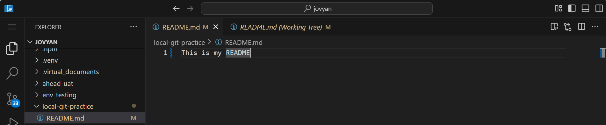

<hr>

- Run `git status`
  - You should see:
    .png)
  - This is an <u>unstaged change</u> <span style="color:skyblue">(the change is only in your working directory)</span>


<hr>

- Run `git add README.md` to stage your change
- Then, run `git status`
  - You should see:
    .png)
  - This is now an <u>staged / uncommitted change</u> <span style="color:skyblue">(the change is now in the staging area)</span>

<hr>

- Run `git commit -m "docs: update README"` to commit your staged change
- Then, run `git status`
  - You should see:
    .png)
  - This is now a <u>committed change</u> <span style="color:skyblue">(the change is now saved to your local git repo)</span>
  - `working tree clean` means your files match the latest commit exactly, so there is nothing left to stage or commit
- Run `git log --oneline` to see your commit at the top of the history
- Go on GitLab and find your repo.
  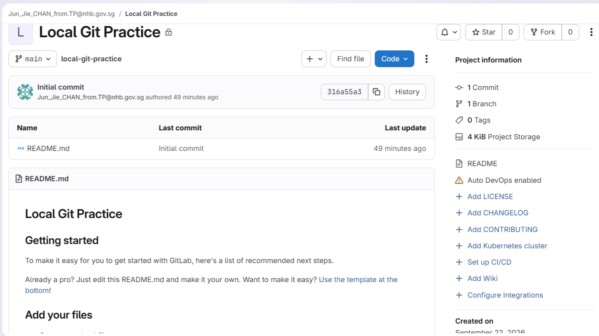
  - Look at the code.
  - You will not find see the changes you made above, as GitHub hosts the remote Git repo, while your changes are still only on the local Git repo

<hr>

- Run `git push` to push all committed changes to remote
- Then, run `git status`
  - You should see:
    .png)
  - The change has now been <u>pushed</u> <span style="color:skyblue">(to the remote git repo hosted on GitLab)</span>
- Now look at your GitLab repo (refresh the page)
  - The updated code should now be visible on GitLab
  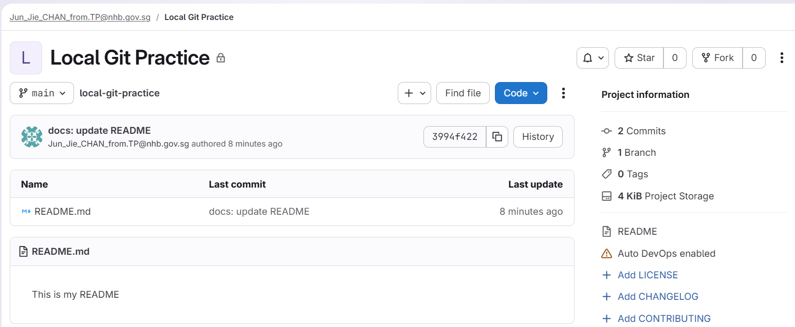


<br>


## Activity 3: Staging and Committing Multiple Files at a Time
#### a. Create 3 new python files
- You can write anything you want in them, or even leave them empty
- Run `git status`
  - You should see:

    .png)

  - This time the files are highlighted green in you left sidebar (`U` means untracked)
  - Note that this time, `git status` highlights that these files are untracked by Git, meaning they have never been staged before

#### b. Stage all 3 files at once
- Run `git add file1.py file2.py file3.py` (adjust for whatever you named the files)
- Then, run `git status`

    .png)

- Now the new files have been staged for the first time and are now tracked by Git (`A` means added, aka newly tracked and staged)


#### c. Commit the changes
- Run `git commit -m "add 3 empty .py files"`
- Run `git status`
  - The changes have now been saved to your local repo in 1 commit
    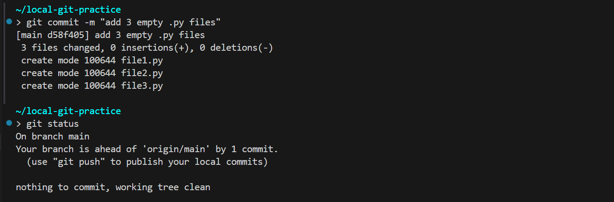

#### d. Make changes to all 3 .py files
- Add / modify lines to 2 of your .py files
- Delete 1 of your .py files entirely
- Run `git status`
  - You should see:
    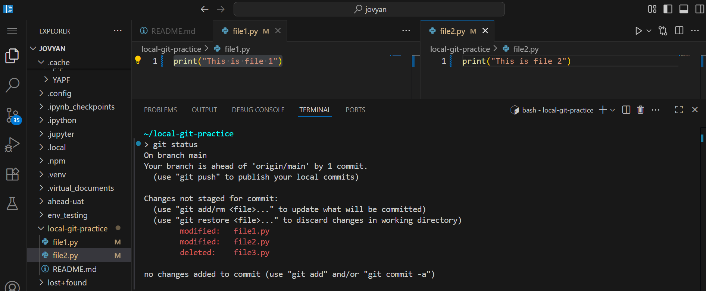
- Stage all changes in the current folder at once using `git add .`
- Commit your changes using `git commit -m "modified file1.py and file2.py, deleted file3.py"`
- Run `git status`
  - You should see:
    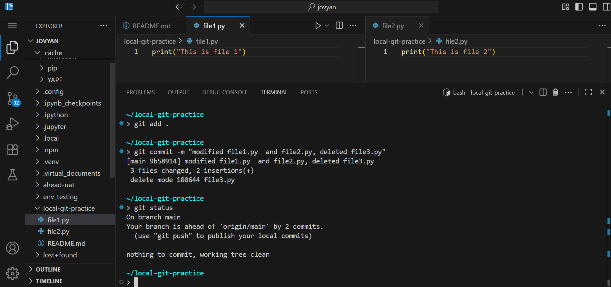

#### e. Push all the changes
- Run `git push`
  - `git push` pushes all commits to remote at once (we have 2 unpushed commits to push).
  - You may push your commits anytime you like, one at a time, or all at once, but remember to do so to ensure your teammates can access your changes
- Now look at your Gitlab repo. Refresh it.
  - All your commits should now be on remote
    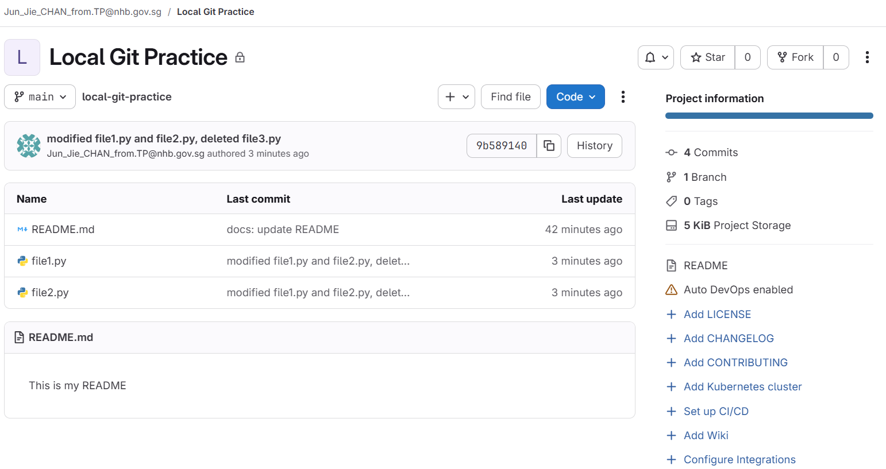


<br>


## Activity 4: Other useful commands and arguments for local workflows
#### a. Unstaging files
- Make changes to the 2 remaining .py files in your working directory
- Stage the changes using `git add .`
- Run `git restore --staged file2.py` to unstage `file2.py`
- Verify only `file1.py` remains staged using `git status`

<hr>

- Stage the `file2.py` change again using `git add file2.py`
- Run `git restore --staged .` to unstage all currently staged files

#### b. Rewriting commit messages
- Stage the 2 changes again using `git add .`
- Run `git commit -m "modify 20 files"`, intentionally making a typo
  - The change has been committed to your local git repo, with the wrong commit message
- Run `git log --oneline`
  - You should see:
    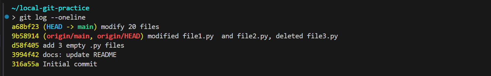
  - `(HEAD -> main)` marks where **you** currently are: the latest commit on your local `main` branch. This is the commit with the typo
  - `origin/main` marks where `main` is on the remote repo on **GitLab** (`origin`). It is 1 commit behind, since we have not pushed the typo commit yet
  - `origin/HEAD` marks GitLab's default branch (`main`)
  - Since the commit with the typo only exists locally, we can still safely rewrite its commit message

<hr>

- Run `git commit --amend -m "modify 2 files"` to rewrite the commit message of the LAST written commit
- Run `git log --oneline`
  - You should now see:
    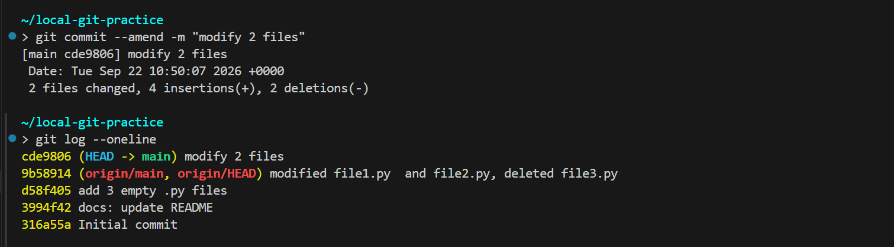
- Push the updated commit using `git push`

<br>


## Activity 5: Writing Multi-line Commits
>- Note: We will go through conventions for writing commit messages in depth in Session 6: Team Workflow Standards

#### a. Make changes to the 2 remaining .py files again
- Run `git add .` to stage the 2 changes
- Run `git commit` without the `-m` flag to open up a nano window to input your commit message
  - nano is a simple text editor that runs inside the terminal. Git opens it whenever it needs you to write a longer message, such as a multi-line commit message
  - You can't use your mouse in nano. Use the arrow keys to move your cursor, and the shortcuts listed at the bottom of the nano window (`^` means `Ctrl`, e.g. `^X` means `Ctrl + X`)
  - There are other code editors that have a better UI/UX but they are unavailable in analytics@gov
- When nano first opens, it looks like this:
  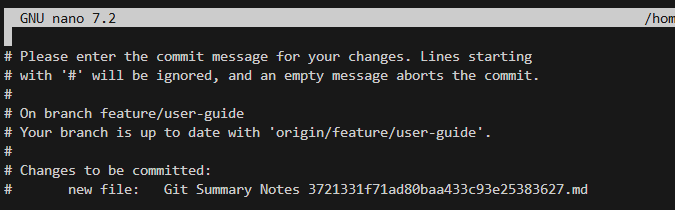
- Write your message at the top, above the lines starting with `#`:

  
Multi-line commit message format:
```
short description

optional longer body paragraphs

optional footer
```

For example:
  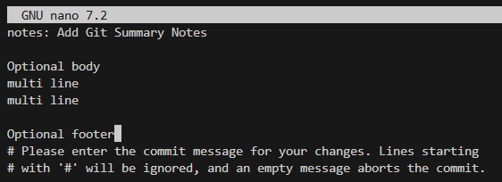

- You can have multiple body paragraphs
- The footer is typically used to link the commit to related issues or merge requests on GitLab, e.g. `Closes #42` (GitLab automatically closes issue #42 when this commit is merged into `main`) or `Refs #42`
  - It can also credit other contributors, e.g. `Co-authored-by: Name <email>`, or flag breaking changes, e.g. `BREAKING CHANGE: <description>`
  - Most commits don't need a footer, so leave it out if there is nothing to link

  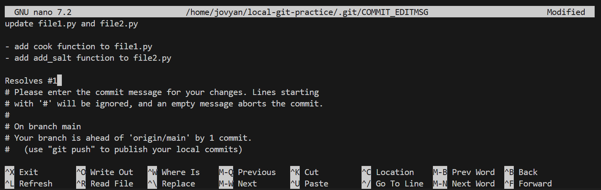

To save your commit message and quit:
1. Press `Ctrl + X`.
2. nano asks `Save modified buffer?`. Press `Y`.
3. nano shows the file name it will save to. Press `Enter`.

<hr>

- The commit has been saved to your local repo alongside the multi-line commit
- Run `git push` to push your commit to remote
- Run `git log --oneline` to see all your commits

#### d. Go to your Gitlab repo page and click to see all the commits pushed to the main branch
- You should see:
  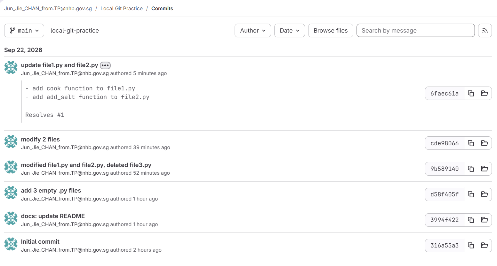

<br>


## Activity 6: Using the VSCode IDE for a more user-friendly UI
  
- The VSCode IDE available on analytics@gov has a UI for Git accessible from the left sidebar
- Changes can be selected to be staged / unstaged one by one, which is convenient when you want to stage only certain files within certain folders
- You can enter your commit message and commit your changes from the left sidebar
- Clicking each changed file also shows a diff that highlights all deletions and additions

#### JupyterLab also has a similar function
  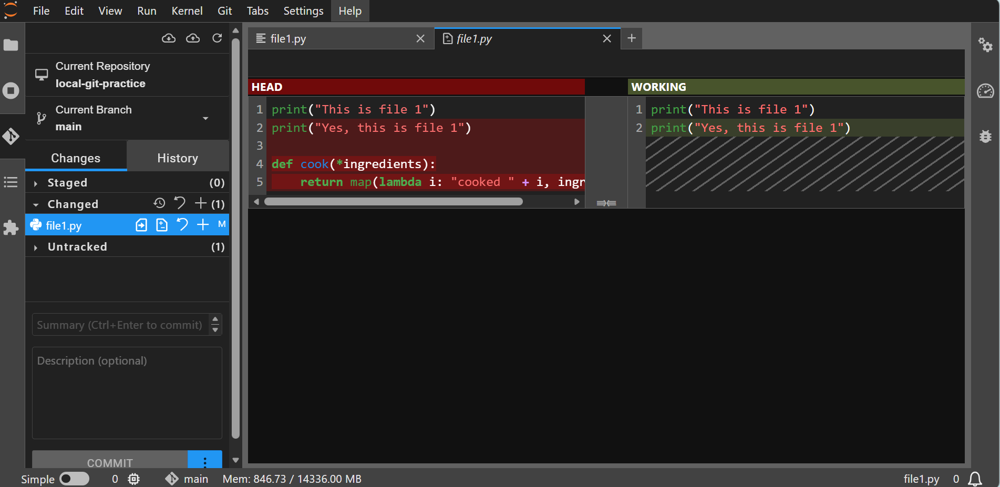


<br>


## Activity 6: Interaction with Jupyter Notebooks
>So far, we have worked with `.md` files, which are plain text. When you change one line, Git shows exactly one line changed.
>
>Jupyter notebooks (`.ipynb`) look like cells in the UI, but underneath, they are one large **JSON** file that stores your code **and** cell outputs (including charts), execution counts and metadata. Let's see what that means for Git.

#### a. Look at what a notebook really is
- From the `Git-Workshop` folder, find `session1.ipynb` within the session 1 folder (`sessions/session1/session1.ipynb`) and copy it to your local repo practice folder
- Open `session1.ipynb` as plain text instead of in the notebook UI
    - JupyterLab: right-click the file → `Open With` → `Editor`
    - VSCode: right-click the file → `Open With...` → `Text Editor`
- Notice the notebook is stored as JSON, with `"cell_type"`, `"source"`, `"outputs"`, `"execution_count"` and `"metadata"` fields
- Close it without saving

#### b. Stage and commit the notebook
- Run `git add .` to stage the newly added notebook
- Run `git commit -m "add notebook"`

<br>


## Activity 7: Writing .gitignore


#### What if the file you want to gitignore has already been pushed?