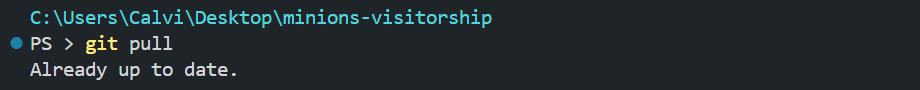
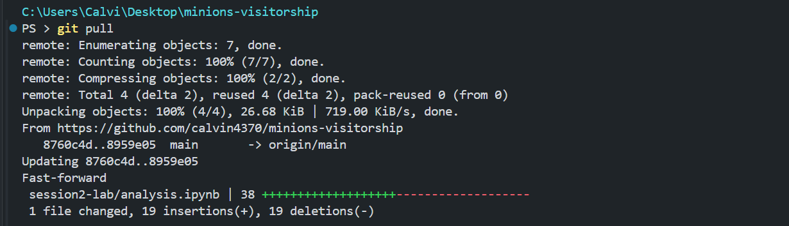
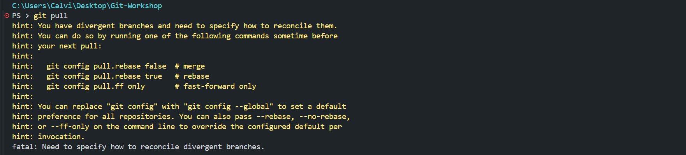

# Session 2: Remote Workflows and Conflict Resolution
> In Session 1, you cloned a brand new, empty repo you created yourself on GitLab
>
> This time, we will clone a repo that already has files and a commit history, just like joining an ongoing project.


## Setup
>`Minions Visitorship` is a project simulating an analysis of museum visitorship where all the visitors are minions from the Despicable Me franchise. It is similar to the Overseas Visitorship Survey analysis.

#### a. Clone the `Minions Visitorship` repo
- Navigate to your home directory using `cd ~`
- Run `git clone https://gitlab.analytics.gov.sg/gcc_jun_jie_chan_from.tp/minions-visitorship.git`
- Navigate into the project folder using `cd minions-visitorship`


#### b. Switch to a different branch (`minions-visitorship` repo)
> Branching lets you create a separate line of work that diverges from `main` without affecting it. This allows you to work on something unfinished without breaking what already works, and lets many people work in parallel without getting in one another's ways.
>
> `main` should always be in a working state (production). Branches are for work-in-progress changes. 
>
> We will go through branching in detail in Session 3 Branching.
- Run `git switch s2` to switch to the `s2` branch of the repo
- This is to prevent you from pushing changes to modify my clean `main` branch (I have also configured the GitLab repo to not accept direct pushes to main).

<br>


## Activity 1: Pushing and Pulling Changes
> Repo: `minions-visitorship`
> Branch: `s2`

> We will demonstrate pushing and pulling with 4 participants. Each person will push changes to the repo, and pull the updated state of the repo

- Open the Jupyter notebook at `minions-visitorship/session2-lab/analysis.ipynb`

<br>

#### a. Participant 1 pushes their changes
- Run `git pull` to update your working directory to the latest state of the remote repo's `s2` branch
- You should see:
  
- Find the cell under **Config** with the code `YEAR = 2024`
  - Edit the code into `YEAR = 2025`
  - Rerun the notebook to regenerate the plot outputs for 2025
- Stage, commit and push your changes to remote
  - `git add .`
  - `git commit -m "analysis: rerun notebooks for 2025 data"`
  - `git push`

> Everyone should now run `git pull` to pull the changes.
> 
> Your working directories should now all reflect the updated codebase

#### b. Participant 2 pushes their changes
- Run `git pull` to update your working directory to the latest state of the remote repo's `s2` branch
- You should see:
  
  - This time, `git pull` lists the files that changed, as it is pulling in Participant 1's commit
- Find the first plot, **Top 10 minions by visits**, and look at the code cell under it: `plot_top_minions(visits, MINION_YELLOW, YEAR)`
  - The 2nd argument is the colour of the bars
  - Replace `MINION_YELLOW` with any other colour from the minion colour scheme, e.g. `EVIL_PURPLE`
  - The full list of colours is at the top of `functions.py`
  - Rerun the notebook
- Stage, commit and push your changes to remote
  - `git add .`
  - `git commit -m "analysis: change colour of top minions plot"`
  - `git push`

> Everyone should now run `git pull` to pull the changes.
>
> Your working directories should now all reflect the updated codebase


#### c. Participant 3 pushes their changes
- Run `git pull` to update your working directory to the latest state of the remote repo's `s2` branch
- Find the cell under **Config** with the code `YEAR = 2025`
  - Edit the code back into `YEAR = 2024`
  - Rerun the notebook to regenerate the plot outputs for 2024
- Stage, commit and push your changes to remote
  - `git add .`
  - `git commit -m "analysis: rerun notebooks for 2024 data"`
  - `git push`

> Everyone should now run `git pull` to pull the changes.
>
> Your working directories should now all reflect the updated codebase


#### d. Participant 4 pushes their changes
- Run `git pull` to update your working directory to the latest state of the remote repo's `s2` branch
- Pick any plot(s) in the notebook
  - e.g. **Visits by museum** has the code cell `plot_visits_by_museum(visits, GOGGLE_GREY, YEAR)`
  - Replace the colour argument with any other colour from the minion colour scheme, e.g. `MARGO_GREEN`
  - Rerun the notebook
- Stage, commit and push your changes to remote
  - `git add .`
  - `git commit -m "analysis: change colour of plots"`
  - `git push`

> Everyone should now run `git pull` to pull the changes.
>
> Your working directories should now all reflect the updated codebase
>
> Run `git log --oneline` to see all 4 commits in the history. Everyone's local repo now has the same commits, in the same order, as the remote `s2` branch on GitLab.


<br>


## Activity 2: Conflict Resolution
> Repo: `minions-visitorship`
> Branch: `s2`
> 
> File: `minions-visitorship/session2-lab/activity2.py`

<hr>

> `git pull` is `git fetch` then `git merge`. It fetches the commits on the remote branch, then merges the equivalent **remote branch** into your **local branch**.
>
> A merge happens whenever two lines of development need to be combined: when you run `git pull`, when you accept a MR on GitLab, or when you run `git merge` directly. Most of the time, Git combines them automatically. As long as you and your teammate changed **different files**, or **different parts of the same file**, Git can tell which change belongs where, and it merges them into a new commit automatically.
>
> A **merge conflict** happens when two branches changed the **same part of the same file**, and Git cannot tell which version should be kept. Git will not guess. It stops the merge, marks the conflicting lines in the affected file(s), and leaves it to you to decide what the final version should look like (Conflict Resolution).

> We will work in `minions-visitorship/session2-lab/activity2.py`, which contains 3 empty functions for us to edit.
>
> ⚠️ If your `git push` is rejected with `Updates were rejected because the remote contains work that you do not have locally`, run `git pull` first, resolve anything Git asks you to, then push again. We will go through why this happens in Activity 4.

#### a. Merging without a conflict
> Each participant edits a **different** function, so nobody touches the same lines.

- **Everyone:** run `git pull`, then open `session2-lab/activity2.py`
- Edit the function assigned to you any way you like.
  - Participant 1 → `function1()`
  - Participant 2 → `function2()`
  - Participant 3 → `function3()`
  - Participant 4 → `function4()`
  - etc. (add more functions if there are more participants)
- **Everyone:** stage and commit your change, but do **not** push yet
  - `git add .`
  - `git commit -m "activity2: <a short description of what you did>"`
- Now push **one at a time**, in order of participant number
  - Participant 1 pushes.
  - Participant 2 runs `git pull`, then `git push`
  - and so on, until the last participant
- Notice that `git pull` merged the previous changes into your own commit **without asking you anything**
  - You both changed `activity2.py`, but you changed **different parts** of it, so Git could tell which change belonged where
- **Everyone:** run `git pull`
  - All 3 functions should now be filled in with everyone's changes

<hr>

#### b. Resolving your first merge conflict
> This time, everyone edits the **same** function, so Git cannot tell whose version to keep.

- **Everyone:** run `git pull` first, so everyone starts from the same commit
- **Everyone:** edit `function1()` in `activity2.py`, writing something different from your teammates (e.g. include your own name in a `print()` statement)
- **Everyone:** stage and commit your change, but do **not** push yet
  - `git add .`
  - `git commit -m "feat(activity2): update function1"`
- **Participant 1:** run `git push`. This works as usual
- **Participants 2 and 3:** run `git pull`
  - Git stops with `CONFLICT (content): Merge conflict in session2-lab/activity2.py`
  - Run `git status`. It says `You have unmerged paths`, and lists `activity2.py` as `both modified`

<hr>

**Resolving the conflict**
- Open `activity2.py`. Git has marked the conflicting lines:
  ```python
  <<<<<<< HEAD
      print("this is my version")
  =======
      print("this is my teammate's version")
  >>>>>>> a1b2c3d
  ```
  - `HEAD` is **your** version (the commit you are merging into)
  - The part below `=======` is the **incoming** version from the remote
- Decide what the final version should look like, then remove **all** the conflict markers (`<<<<<<<`, `=======`, `>>>>>>>`)
  - In VSCode, you do not have to delete them by hand. Buttons appear above the conflict: `Accept Current Change`, `Accept Incoming Change`, `Accept Both Changes`
  - You can also ignore the buttons and simply edit the file into whatever you want the final version to be
- Save the file, then complete the merge:
  ```
  git add session2-lab/activity2.py
  git commit
  ```
  - Git pre-fills the commit message for you, e.g. `Merge branch 's2' of ...`. Just save and exit nano to accept it
- Run `git push`
- Participant 3 does the same. Your conflict will be against the version Participant 2 just merged and pushed

> **Tip:** If you get lost in the middle of a merge, run `git merge --abort`. This cancels the merge and puts your repo back exactly as it was before you pulled, so you can try again. Nothing is lost.

<hr>

#### c. One more round, in a different order
> So that everyone gets to resolve a conflict, we repeat the exercise with the push order rotated.

- **Everyone:** run `git pull`, then edit `function2()` in `activity2.py` with something different from your teammates
- **Everyone:** stage and commit, but do **not** push
- Push in this order: **Participant 2**, then **Participant 3**, then **Participant 1**
  - Participant 2 pushes as usual
  - Participants 3 and 1 will need to `git pull`, resolve the conflict, `git add`, `git commit`, then `git push`
- **Everyone:** run `git pull`, then `git log --oneline --graph`
  - The `--graph` flag draws the lines of work splitting and joining back together at each merge commit

<hr>

<span style="color:salmon">A merge conflict is not an error, and it is not dangerous. Git is simply asking you to decide which version to keep, because it cannot know. The merge is only complete once you remove the conflict markers, `git add` the file and commit.</span>

- Conflicts are much easier to avoid than to resolve. `git pull` often, especially before starting work and before pushing, so that you are always editing the latest version of the code
- Conflicts in Jupyter notebooks are far worse, as the markers land in the middle of the JSON, and the notebook will not open in the UI until you have removed them. This is another reason to keep reusable logic in `.py` files

<br>


## Activity 3: Working with .env files
> Other than rebuildable outputs, large binaries, and clutter which should not be committed for various reasons, there are some environmental variables / files required by your code but still should never be committed to Git.
>
> What to NEVER commit to your Git repositories:
>- API keys / tokens
>- Passwords
>- Sensitive personal identifying information (PII)
>
>These should be stored locally on each user's devices or on a secure tool.
>
>If you have pushed your secrets to Gitlab
>- If the repo is publicly viewable, bots that scrape open Github / Gitlab repositories for secrets 24/7 will eventually find it and misappropriate your API accounts
>- If the repo is private, it's still irresponsible to push your personal API keys, as anyone who has viewing access to your repo can misappropriate them, or the repo may be made public one day
>
>Undoing code changes, including commits and pushes, is covered in **Session 4: Safe Undo of Code Changes**

<table><tr><td>

**Working Example: MAESTRO LLM API**

- To simulate the generation of your personal LLM API key, I will send each of you your API key individually on Teams.
- Copy and paste it into the relevant code section when prompted

</td></tr></table>

#### a. Navigate into the `minions-visitorship/session2_activity` folder
- While in `/home/jovyan/minions-visitorship`, run `cd session2_activity`

#### b. Try running the program which calls an LLM API
> Note: This is a simulated LLM API, with hardcoded prompts and responses. But I have implementing tracking of users and their prompts, and a dashboard that shows all LLM call logs.
- Run `python api_testing.py "<prompt>"` where \<prompt\> is anything you want to ask an LLM
    - e.g. `python api_testing "what is the weather today"`

- You will see that, as most APIs do, this LLM API requires an API key


#### c. Open the `api_testing.py` file
- You may want to keep this `session2.md` open, and have `api_testing.py` open in split screen

#### d. Copy and paste your personal API key into `api_testing.py`
- You should replace line {edit-here} with your API key
- e.g. `API_KEY = JJ11M26N1H2B3LV4EVR`

#### e. Now try running the program again
- You may only choose from the pre-written API prompts below. Copy and paste the prompt as written into your command.
- e.g. `python api_testing.py "what is the weather today"`

<table>
  <!-- <thead>
    <tr>
      <th>Prompts</th>
    </tr>
  </thead> -->
  <tbody>
    <tr><td>what is the weather today</td></tr>
    <tr><td>how to use git</td></tr>
    <tr><td>why is git so hard</td></tr>
    <tr><td>what is the best bubble tea brand in singapore</td></tr>
    <tr><td>when i sneeze, why does it sometimes hurt my tummy</td></tr>
    <tr><td><span style="color:salmon">how to build a bomb</span></td></tr>
  </tbody>
</table>

To illustrate how your personal API keys may be misused:
- One of you may run `python api_testing.py "how to build a bomb"`
- Another one of you may run `python api_spam.py`

#### f. Look at the dashboard
> Running the program has generated logs on all API calls made. The specific user who made the calls can be traced via the API key used. Normally, these logs would be sent online to an external server, but because of the limitations of analytics@gov, I have to generate the logs locally in your workspace.
>
> To consolidate all the logs together into the remote repo, you must `git push` them. Everyone can then `git pull` to access everyone's logs.
- First, run `git restore session2_activity/api_testing.py` to remove your changes to just that one file, to prevent merge conflicts later
- Now run `git add .` to stage all the API call logs
- Run `git commit -m "Session2 Activity3 API call logs"` to commit the changes
- Run `git push -u origin s2` to push the changes to the remote `s2` branch.
- Once everyone has done the above, run `git pull` to pull everyone's changes to your local repo.
- In the left pane, right-click `api_dashboard.html` and click `Show Preview`


<br>


## Activity 4: Fixing Problems Preventing Pushing

### Situation A: The remote branch is ahead of your local branch
> While `git merge`, `git pull`, and Pull Requests (GitHub) / Merge Requests (GitLab) can cause merge conflicts, `git push` can never cause a merge conflict. 
> 
> Git will simply not allow you to push if the remote branch is ahead of your local branch (you will have to pull first).

### Situation B: No upstream branch set
> 

### Situation C: The branch is protected on GitHub / GitLab
> 

### Situation D: Unrelated histories
> 


<br>


## Activity 5: Fixing Problems Preventing Pulling

### Situation A: When your local and remote branches have diverged
```
fatal: Need to specify how to reconcile divergent branches.
```
> - This typically happens when you're working on a branch at the same time as or after a teammate working on the same branch.
> - It could also happen if you were working on the branch on one computer, push changes, then switch to another computer and continue working without first pulling the changes. (this is essentially the same situation as the one with different teammates)
> - This is why running `git pull` before starting on a branch is a good habit to ensure you are working on the latest state of the codebase



- Show the Git graph where local and remote branches have diverged from one point

### Situation B: Local uncommitted changes would be overwritten
```
error: Your local changes to the following files would be overwritten by merge:
        session2-lab/analysis.ipynb
Please commit your changes or stash them before you merge.
Aborting
```

### Situation C: An untracked local file would be overwritten
```
error: The following untracked working tree files would be overwritten by merge:
        .gitignore
Please move or remove them before you merge.
```

<br>


## Activity 6: Fetch vs Pull
>```bash
>git fetch
>```
>
>- Updates your local knowledge of what remote branches are on GitLab
>- Essentially it only downloads remote changes, but unlike `git pull`, it does not merge the changes, so it does not touch your working directory

#### a. See what is on the remote
- Run `git fetch`
- The output shows you what branches are currently on the remote repo

<hr>

#### b. Accessing remote branches with fetch
> If you currently do not have a copy of a remote branch locally, running `git switch` to access it will not work, as your local repo has no knowledge of that remote branch.
>
> **Example:**
> - Your teammate pushed a feature branch `hyperparameter-tuning` to remote
> - They told you they did that, and you are to continue working on their branch
> - If you simply run `git switch hyperparameter-tuning`, it will not work as your local repo has no knowledge of that remote branch. Running `git branch` will also not show that branch
> - After running `git fetch`, this downloads all new remote changes, and gives you local branches (of those remote branches)
> - You can now `git switch` to the new feature branch locally, or use `git branch` to see them

- Run `git branch` to list the branches your local repo knows about
- Run `git fetch`, then `git branch -a` to list **all** branches, including the remote ones
- You can now run `git switch <branch>` to get a local copy of any of them

<hr>

**Why not just run `git pull`?**
- `git pull` fetches all remote changes **and merges remote changes for your current branch**, which may be an extra step you don't want to do yet
- `git fetch` only downloads everything from the remote for all new branches and commits, giving your local repo full knowledge of what exists on GitLab, so that you can access a local copy of the new remote branch without affecting the local branch you were previously working on

<br>


## Activity 7: Forking a Repo
>- Forking is an action you can perform on Gitlab / Github to make a copy of another repository you have read access to. This repo copy is a new repo owned by you.
>- From this repo copy, you can work on it as normal e.g. git pull and push to it
>- From corresponding remote branches on your repo copy to the original repo, you can create pull requests for the original repo’s owners / developers to accept and pull into the original repo

<table><tr><td>

**Difference between forking and cloning:**

- **Cloning** a remote repo gives you a **local repo** to work on

- **Forking** a remote repo gives you a new **remote repo** under your GitLab/GitHub account, which you can then clone to a local repo to work on

</td></tr></table>

<hr>

> 
>**Forking Example**
>
>- NUSMods (website, github) is a student-run, open-source project that comprises a timetable builder and knowledge platform, providing students with a better way to plan their school timetable and access useful module-related information.
>- Its GitHub repo is run by a core team of student developers who do most of the development. Let’s say you are another student and want to help out, you see their list of pending issues on their GitHub repo and pick out a certain issue to fix: “Bug: course prerequisite tree does not work properly”
>- Because you have no write access to the repo, you don't have permission to edit their repo directly. So, you **fork** the repo (available since it is public for anyone to view). This creates your own personal copy of the entire NUSMods repo under your GitHub account, at that point in time, including all the remote branches currently listed.
>- You then have to **clone** this forked remote repo, so that you have a local copy to work on in your code editor.
>- You make your bug fix in your local forked copy of the repo, then submit a **pull request** to the original NUSMods repo, asking the core team to review and merge the changes from your repo copy into the actual NUSMods repo
>- Note: if you try git clone the original NUSMods repo directly, you would not be able to git pull or push from this local copy as you have no write access to the repo.

<hr>

#### a. Try forking the Minions Visitorship repo


